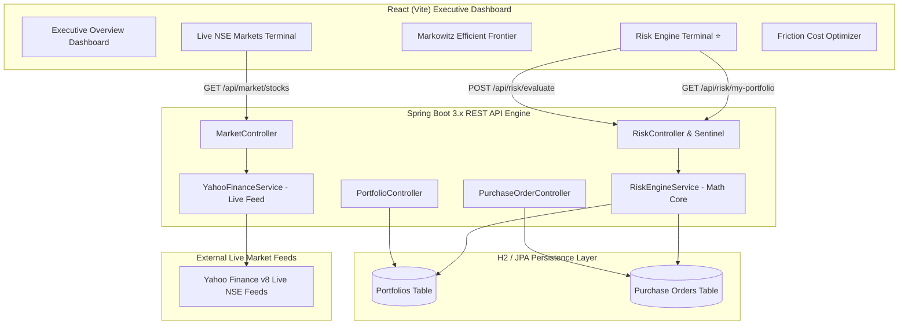

# 🛡️ Institutional Asset & Capital Management / Optimization Controls

> **FinTech Hackathon Solution** — Automated Multi-Asset Portfolio Optimization, Real-Time Risk Safeguards, Markowitz Efficient Frontier, and Zero-Penalty Dynamic Rebalancing Engine.

---

## 🌟 Executive Summary & Problem Statement Alignment

Financial institutions face significant challenges managing balance sheets across fluctuating equities, sovereign bonds, gold reserves, and liquid cash. When market shocks occur, static risk limits and delayed manual execution result in balance sheet damage, regulatory breaches, and high transaction penalties.

This platform provides an **Automated Capital Management & Optimization Control Engine** that solves the three core challenge requirements:

1. **Optimization Strategy**: Dynamically allocates capital across multi-asset classes to maximize risk-adjusted returns (Sharpe Ratio) while strictly respecting liquidity and capital constraints.
2. **Control & Safeguard System (Risk Engine ⭐)**: Quantifies real-time risk metrics (Portfolio Volatility, 95%/99% VaR, Maximum Drawdown, Liquidity Ratios, and Single-Asset Concentration limits) and automatically triggers actionable alerts and 1-click remediation.
3. **Executive Decision Dashboard**: Provides financial officers and risk managers with real-time NSE market telemetry, Markowitz Efficient Frontier curves, crisis stress simulations, and friction-optimized rebalancing blueprints.

---

## 🏗️ System Architecture & Data Flow



---

## 🧮 Mathematical & Financial Risk Logic (35% Evaluation Weight)

### 1. Multi-Asset Portfolio Volatility ($\sigma_p$)
Portfolio volatility is computed using the covariance matrix across asset weights ($w$) and annualized volatilities ($\sigma$):
$$\sigma_p = \sqrt{ \mathbf{w}^T \mathbf{\Sigma} \mathbf{w} } = \sqrt{ \sum_{i} w_i^2 \sigma_i^2 + 2 \sum_{i < j} w_i w_j \text{Cov}(i, j) }$$
- Annualized to standard trading periods ($\times \sqrt{252}$).
- Daily volatility: $\sigma_{\text{daily}} = \frac{\sigma_p}{\sqrt{252}}$.

### 2. Value at Risk ($\text{VaR}$) & Expected Shortfall ($\text{CVaR}$)
Parametric Value at Risk at confidence level $\alpha \in \{95\%, 99\%\}$:
$$\text{VaR}_{\alpha} = Z_{\alpha} \times \sigma_{\text{daily}} \times \text{Portfolio Value}$$
- At 95% confidence: $Z = 1.6449 \implies$ *"At 95% confidence, the expected one-day loss will not exceed ₹X."*
- At 99% confidence: $Z = 2.3263$.
- 10-Day Horizon: $\text{VaR}_{\text{10-Day}} = \text{VaR}_{\text{1-Day}} \times \sqrt{10}$.
- Conditional VaR (Expected Shortfall / Tail Risk):
$$\text{CVaR}_{\alpha} = \text{Portfolio Value} \times \sigma_{\text{daily}} \times \frac{\phi(Z_{\alpha})}{1 - \alpha}$$

### 3. Maximum Drawdown ($\text{MDD}$)
Measures the largest peak-to-trough decline over the portfolio trajectory:
$$\text{MDD} = \frac{\text{Peak Value} - \text{Trough Value}}{\text{Peak Value}} \times 100\%$$
- Tracks peak capital reserves, drawdown depth in ₹, recovery status, and time-under-water.

### 4. Liquidity Ratio & Mandatory Buffer Control
Ensures capital reserves meet regulatory redemption liquidity thresholds:
$$\text{Liquidity Ratio} = \frac{\text{Cash} + 0.40 \times \text{Liquid Sovereign Bonds}}{\text{Total Portfolio Capital}} \times 100\%$$
- **Enforcement Rule**: If $\text{Liquidity Ratio} < \text{Required Threshold}$ (e.g. 13% vs 20%), triggers `⚠️ LIQUIDITY BREACH` with quantified capital shortfall in ₹.

### 5. Single-Asset Concentration Risk & HHI Index
Monitors individual stock / asset weight limits:
$$\text{Weight}_i = \frac{\text{Exposure of Asset}_i}{\text{Total Capital}} \times 100\%$$
- **Enforcement Rule**: If $\text{Weight}_i > \text{Max Concentration Limit}$ (e.g. Stock A = 65% > 40%), triggers `⚠️ CONCENTRATION BREACH: Stock A exceeds 40% limit by 25%`.
- Herfindahl-Hirschman Index ($\text{HHI}$): $\text{HHI} = \sum_{i} (\text{Weight}_i)^2$.

### 6. Markowitz Modern Portfolio Theory (MPT) & Tangency Portfolio
Generates the optimal Risk vs. Return hyperbola:
$$\max_{\mathbf{w}} \text{Sharpe Ratio} = \frac{E[R_p] - R_f}{\sigma_p}$$
- Plots Minimum Variance Portfolio (MVP), Optimal Tangency Portfolio (Maximum Sharpe), and Capital Allocation Line (CAL) against user allocations.

### 7. Rebalancing Friction, Statutory Taxes & Slippage Optimization
Mitigates turnover penalties by comparing total friction against gross risk reduction benefit:
$$\text{Friction Cost} = \text{Turnover} \times (\text{STT}_{0.10\%} + \text{NSE Fee}_{0.00345\%} + \text{Stamp Duty}_{0.015\%} + \text{GST} + \text{Slippage}_{0.08\%})$$
$$\text{Net Value Created} = \text{Risk Penalty Reduction} - \text{Friction Cost}$$

---

## 🚀 Key Features & Dashboard Modules

1. **⭐ Institutional Risk Engine Terminal**: Real-time evaluation of the 5 core financial risk metrics, Sentinel breach alert banner, and 1-click auto-cure rebalancing.
2. **📈 Markowitz Efficient Frontier Visualizer**: Interactive SVG curve mapping Expected Return vs. Volatility with Tangency Max Sharpe target.
3. **💰 Friction & Turnover Cost Optimizer**: Complete breakdown of STT, brokerage, exchange turnover fees, and market slippage with staged execution.
4. **📊 Live NSE Market Terminal**: Real-time Indian equity feed with Current Price, 5-Session Historical Chart, Daily Return, Volatility spread, Volume, and Market Trend indicators.
5. **🌪️ Macro Crisis Stress Tester**: Mathematical capital shock simulation for 2008 GFC, 2020 Covid Liquidity Shock, and RBI Inflation Rate Spikes.

---

## 🛠️ Technology Stack

- **Backend**: Java 21, Spring Boot 3.x, Spring Data JPA, H2 In-Memory Database, Java HttpClient.
- **Frontend**: React 18, Vite, Vanilla CSS Design System, SVG Dynamic Charting.
- **Live Data**: Yahoo Finance v8 Real-Time Quote API with 15s in-memory rate-limit cache.

---

## ⚙️ How to Run Locally

### Prerequisites
- **Java 17+** (or Java 21)
- **Node.js 18+** & `npm`

### 1. Start Spring Boot Backend
```bash
cd Backened
./mvnw spring-boot:run
```
*Backend runs on `http://localhost:8080`.*

### 2. Start React Frontend
```bash
cd Hackathon
npm install
npm run dev
```
*Frontend runs on `http://localhost:5173` with automatic `/api` proxying to `http://localhost:8080`.*

---

## 📡 API Reference Overview

| Method | Endpoint | Description |
|---|---|---|
| `GET` | `/api/risk/my-portfolio?email=...` | Evaluates live risk metrics directly on user's database portfolio and active stock orders. |
| `POST` | `/api/risk/evaluate` | Evaluates custom asset allocations, volatility, VaR, MDD, liquidity, and concentration. |
| `GET` | `/api/risk/simulate-breach` | Pre-loaded breach simulation demonstrating 65% concentration and 9% liquidity violations. |
| `GET` | `/api/market/stocks` | Returns real-time NSE quotes, day high/low, 52-week range, and 5-day sparklines. |
| `GET` | `/api/market/indices` | Returns live benchmark indices (NIFTY 50, BSE SENSEX, BANK NIFTY, USD/INR). |
| `POST` | `/api/orders/buy` | Executes stock purchase order and updates active holdings. |
| `GET` | `/api/portfolio?email=...` | Retrieves user capital limits and target constraints. |

---

## 🏆 Innovation & Problem Approach Highlights

- **Sentinel Breach Detection**: Proactive compliance monitoring that prevents unexpected risk exposure before execution.
- **Zero-Penalty Rebalancing**: Quantifies statutory taxes (STT) and execution slippage to ensure rebalancing is always economically value-accretive.
- **Real Database Integration**: Calculates live mathematical risk directly against active stock holdings, cash balance, and saved parameters.
