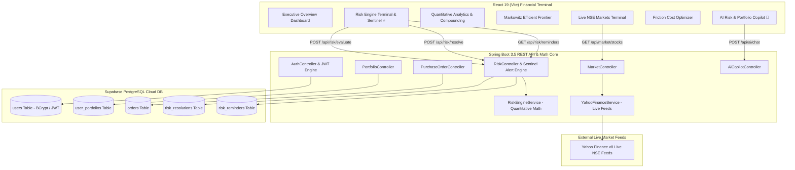

# 🛡️ Institutional Capital Management, Quantitative Risk Engine & Optimization Platform

> **FinTech Hackathon Project by avg boyzz** — Automated Multi-Asset Portfolio Optimization, Real-World Constraint Solver, Real-Time Risk Safeguards, AI Risk Copilot, Markowitz Efficient Frontier, and PostgreSQL Audit-Logged 1-Click Breach Remediation.

---

## 🌟 Executive Summary & Problem Statement Alignment

Financial institutions face significant challenges managing balance sheets across fluctuating equities, sovereign bonds, gold reserves, and liquid cash. When market shocks occur, static risk limits and delayed manual execution result in balance sheet damage, regulatory breaches, and high transaction penalties.

Traditional algorithms often commit the **"naive optimization flaw"**—allocating 100% of capital to whichever single asset class produced the highest recent return.

This platform provides an **Automated Capital Management & Quantitative Risk Engine** that strictly enforces **Real-World Constraints**, continuously tracks market step-down shocks, and enables **1-click database-logged remediation**.

---

## 🎯 The Real-World Constraints Model

Our optimization engine strictly satisfies institutional governance guardrails:

$$\text{Stock Exposure} \le 40\% \quad\Big|\quad \text{Sovereign Bonds} \le 50\% \quad\Big|\quad \text{Gold Reserves} \le 25\% \quad\Big|\quad \text{Liquid Cash Buffer} \ge 15\%$$
$$\text{Portfolio 1-Day VaR}_{95\%} \le 6.0\% \quad\Big|\quad \text{Annualized Volatility } \sigma_p \le 14.0\%$$

### Case Study: Before vs. After Optimization

| Metric / Asset Class | Unconstrained Problem Portfolio | System Constrained Portfolio | Institutional Compliance Status |
| :--- | :--- | :--- | :--- |
| **Equities (Stocks)** | **60.0%** (₹6,00,000) | **35.0%** (₹3,50,000) | ✅ Cured to $\le 40\%$ Limit |
| **Sovereign Bonds** | **20.0%** (₹2,00,000) | **35.0%** (₹3,50,000) | ✅ Preserved $\le 50\%$ Limit |
| **Gold Reserves** | **10.0%** (₹1,00,000) | **15.0%** (₹1,50,000) | ✅ Safe Haven $\le 25\%$ Limit |
| **Liquid Cash Buffer** | **10.0%** (Deficit) | **15.0%** (₹1,50,000) | ✅ Guardrail Met $\ge 15\%$ Limit |
| **1-Day Value at Risk (VaR)** | **8.2%** (Critical Risk) | **5.1%** (Controlled) | ✅ Within $\le 6.0\%$ VaR Budget |
| **Single-Asset Concentration** | **HIGH BREACH** | **NORMAL / BALANCED** | ✅ Diversified Equilibrium |

---

## 🏗️ System Architecture & Data Flow



---

## 🧮 Mathematical & Financial Risk Models

### 1. Multi-Asset Portfolio Volatility ($\sigma_p$)
$$\sigma_p = \sqrt{ \mathbf{w}^T \mathbf{\Sigma} \mathbf{w} } = \sqrt{ \sum_{i} w_i^2 \sigma_i^2 + 2 \sum_{i < j} w_i w_j \text{Cov}(i, j) }$$
- Annualized with trading period factor: $\times \sqrt{252}$.
- Daily volatility: $\sigma_{\text{daily}} = \frac{\sigma_p}{\sqrt{252}}$.

### 2. Parametric Value at Risk ($\text{VaR}$) & Expected Shortfall ($\text{CVaR}$)
$$\text{VaR}_{\alpha} = Z_{\alpha} \times \sigma_{\text{daily}} \times \text{Portfolio Value}$$
- At 95% confidence: $Z = 1.6449$.
- At 99% confidence: $Z = 2.3263$.
- Conditional Tail Risk (CVaR):
$$\text{CVaR}_{\alpha} = \text{Portfolio Value} \times \sigma_{\text{daily}} \times \frac{\phi(Z_{\alpha})}{1 - \alpha}$$

### 3. Maximum Drawdown ($\text{MDD}$)
$$\text{MDD} = \frac{\text{Peak Capital} - \text{Trough Capital}}{\text{Peak Capital}} \times 100\%$$

### 4. Mandatory Liquidity Guardrail Ratio
$$\text{Liquidity Ratio} = \frac{\text{Liquid Cash} + 0.40 \times \text{Sovereign G-Sec Bonds}}{\text{Total Portfolio Capital}} \times 100\%$$

### 5. Markowitz Modern Portfolio Theory (MPT) & Sharpe Maximization
$$\max_{\mathbf{w}} \text{Sharpe Ratio} = \frac{E[R_p] - R_f}{\sigma_p}$$

### 6. Statutory Transaction Friction & Slippage Model
$$\text{Friction Cost} = \text{Turnover} \times (\text{STT}_{0.10\%} + \text{NSE Fee}_{0.00345\%} + \text{Stamp Duty}_{0.015\%} + \text{GST} + \text{Slippage}_{0.08\%})$$
$$\text{Net Value Created} = \text{Risk Penalty Reduction} - \text{Friction Cost}$$

---

## 🚀 Key Modules & Capabilities

1. **⭐ Institutional Risk Engine Terminal**: Real-time evaluation of the 5 core financial risk metrics, Sentinel breach alert banner, and 1-click auto-cure rebalancing.
2. **💾 PostgreSQL Database Audit Trail (`risk_resolutions`)**: Every cured breach is permanently logged with before/after allocations, VaR improvement, and resolution ID.
3. **🔔 Market Step-Down Sentinel (`risk_reminders`)**: Automated alerts triggered when market drawdowns breach configured risk limits with 1-click mitigation actions.
4. **🤖 AI Risk & Portfolio Copilot**: Interactive conversational assistant explaining quantitative models, breach causes, and stress scenarios.
5. **📈 Markowitz Efficient Frontier Visualizer**: Interactive dynamic tangent curve mapping Expected Return vs. Volatility with Tangency Max Sharpe target.
6. **📊 Multi-Year Wealth Compounding Engine**: 1Y to 20Y capital projection simulator based on live blended CAGR with milestone timeline charts.
7. **💰 Friction & Statutory Cost Optimizer**: Micro-level breakdown of STT, brokerage, exchange turnover fees, and market slippage.
8. **📈 Live NSE Market Terminal**: Real-time Indian equity feed with Current Price, 5-Session Historical Chart, Daily Return, Volatility spread, and Volume indicators.
9. **🔐 Enterprise JWT Security**: RFC 7519 HS256 JWT tokens + BCrypt password hashing + automatic session restoration on browser refresh.

---

## ⚙️ How to Run Locally

### Prerequisites
- **Java 17+** (or Java 21)
- **Node.js 18+** & `npm`
- **Git**

---

### Step 1: Clone the Repository
```bash
git clone https://github.com/your-repo/avg-boyzz.git
cd avg-boyzz
```

---

### Step 2: Start the Spring Boot Backend

Open a terminal in the project root:

```bash
# Navigate to the backend folder
cd Backened

# On Windows (PowerShell / Command Prompt):
.\mvnw.cmd spring-boot:run

# On macOS / Linux:
./mvnw spring-boot:run
```

- **Backend Port**: `http://localhost:8080`
- **Database**: Pre-configured with Supabase PostgreSQL cloud database (automatic table initialization).

---

### Step 3: Start the React Frontend

Open a **second terminal** in the project root:

```bash
# Navigate to the frontend folder
cd Hackathon

# Install frontend dependencies
npm install

# Start the Vite development server
npm run dev
```

- **Frontend URL**: `http://localhost:5173`
- **Proxying**: The frontend automatically routes all `/api/*` calls to the Spring Boot backend on `http://localhost:8080`.

---

## 📡 API Reference Overview

| HTTP Method | Endpoint | Description |
| :--- | :--- | :--- |
| `POST` | `/api/auth/register` | Creates a new user account with BCrypt password hashing and issues a signed JWT token. |
| `POST` | `/api/auth/login` | Authenticates credentials and returns user identity and signed JWT token. |
| `GET` | `/api/auth/me` | Verifies and validates active JWT token from `Authorization: Bearer <token>` header. |
| `GET` | `/api/risk/my-portfolio?email=...` | Evaluates live mathematical risk metrics against active holdings and order history. |
| `POST` | `/api/risk/evaluate` | Evaluates custom allocations for Volatility, VaR, MDD, Liquidity, and Concentration. |
| `POST` | `/api/risk/resolve` | Persists a cured risk resolution event into table `risk_resolutions`. |
| `GET` | `/api/risk/resolutions?email=...` | Fetches historical database resolution audit log for the user. |
| `GET` | `/api/risk/reminders?email=...` | Retrieves market step-down reminders from table `risk_reminders`. |
| `POST` | `/api/risk/reminders/trigger` | Triggers a market step-down risk breach reminder. |
| `POST` | `/api/ai/chat` | AI Risk Copilot chatbot for natural language explanations and stress test scenarios. |
| `GET` | `/api/market/stocks` | Fetches real-time NSE stock prices, 52-week ranges, and historical sparklines. |
| `GET` | `/api/market/indices` | Fetches real-time market benchmark indices (NIFTY 50, SENSEX, BANK NIFTY). |
| `POST` | `/api/orders/buy` | Executes stock purchase order and updates active user holdings. |
| `POST` | `/api/portfolio/save` | Saves user capital, risk tolerance, and liquidity limits. |

---

## 👥 Team — avg boyzz
- Built for the 2026 FinTech Hackathon.
